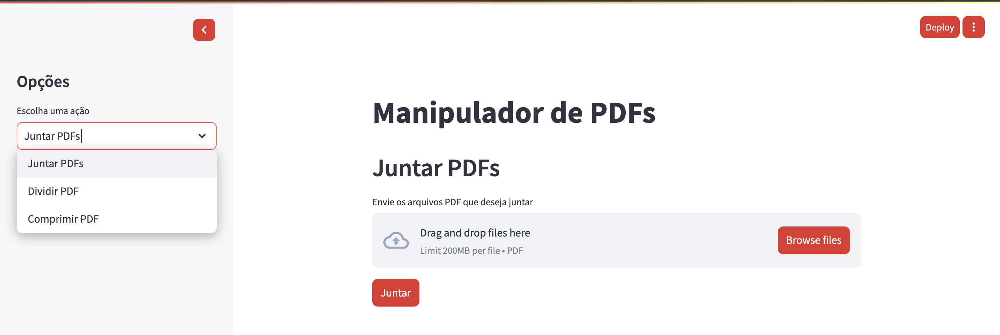

# Manipulador de PDF  
Uma aplicação web simples e eficiente para manipulação de arquivos PDF, desenvolvida com Python e Streamlit.

## Funcionalidades  
- **Juntar PDFs**: Combine múltiplos arquivos PDF em um único documento.  
- **Dividir PDF**: Escolha páginas ou intervalos para dividir um PDF em partes específicas, com cálculo estimado do tamanho de cada divisão.  
- **Comprimir PDF**: Reduza o tamanho do arquivo mantendo a qualidade ajustável.  

## Tecnologias Utilizadas  
- **Python**: Linguagem principal do projeto.  
- **Streamlit**: Framework para construção da interface web.  
- **PyPDF2**: Manipulação de arquivos PDF (juntar e dividir).  
- **Ghostscript**: Utilizado para compressão eficiente de arquivos PDF.  
